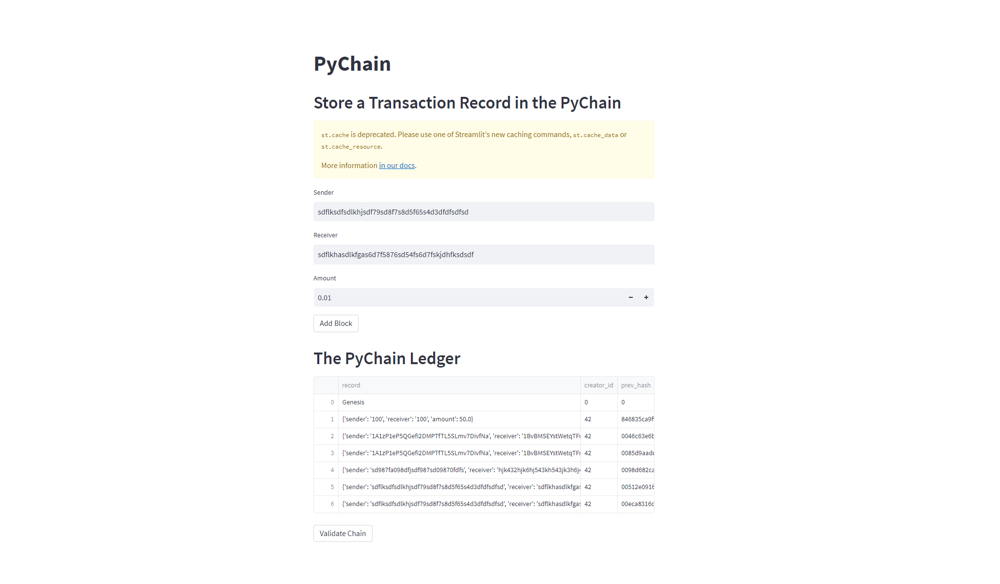
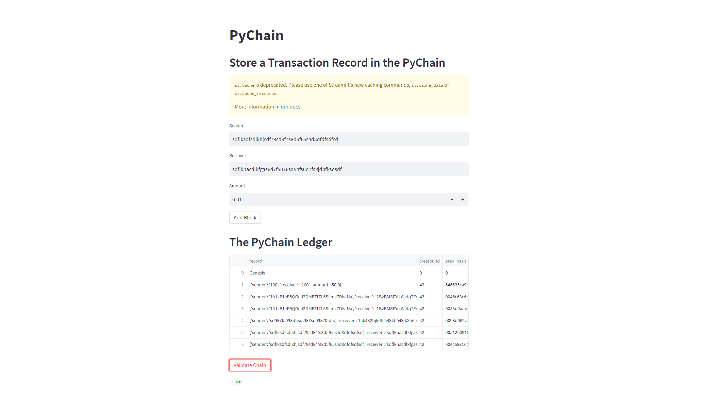

# PyChain Ledger

This project is a simple blockchain-based ledger system called PyChain. It allows users to create and store transaction records, add them as blocks to the blockchain, and validate the blockchain. The application is built using Python and Streamlit for the user interface.

## Features

- Create transaction records with sender, receiver, and amount information.
- Mine new blocks and add them to the blockchain.
- Validate the integrity of the blockchain.
- Inspect individual blocks in the blockchain.

## Technologies Used

- Python
- Streamlit
- Pandas
- hashlib

## Author

Alex Dvorak

